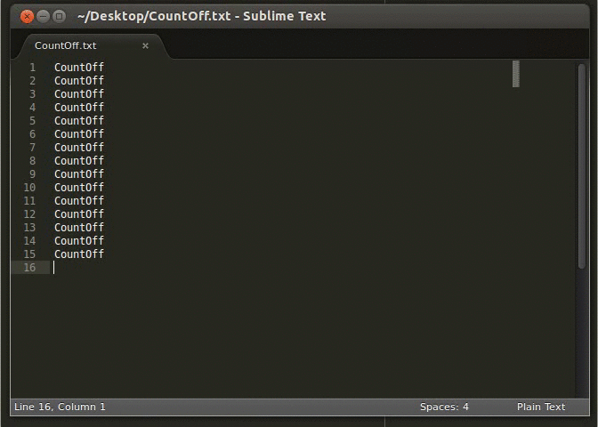

# CountOff for Sublime Text 2 & 3





## About

Debugging tool for sequentially counting off and inserting numbers.


## Usage

The primary purpose of CountOff is to aid in debugging code. You can add multiple `echo "here";` statements
throughout a file, select the end of the string and "CountOff".

### Example:
```PHP
echo "here";
echo "here";
echo "here";
```

will become...
```PHP
echo "here1";
echo "here2";
echo "here3";
```


## Plugin usage

Select one or multiple selector positions and press <kbd>ctrl</kbd>+<kbd>k</kbd>, <kbd>ctrl</kbd>+<kbd>o</kbd>.

### Tips:

* CountOff can also be found in the context (right-click) menu or under the Tools menu option.
* You can select mutliple lines with Sublime Text by highlighting all the lines, then pressing <kbd>ctrl</kbd>+<kbd>shift</kbd>+<kbd>L</kbd>, then hitting <kbd>End</kbd>.


## Options

* `include_zero` (`bool=false`): Start counting at 0 if true, else start counting at 1.
* `zero_fill` (`bool=false`): Left pad with zeroes if true to match width of max count.
* `reverse_order` (`bool=false`): Count up if true, else count down.

### Examples:

#### zero_fill

```
    // zero_fill=false
    1, 2, 3, .. 9, 10, 11

    // zero_fill=true (max one digit)
    1, 2, 3, .. 7, 8, 9

    // zero_fill=true (max two digits)
    01, 02, 03, .. 09, 10, 11

    // zero_fill=true (max three digits)
    001, 002, 003, .. 099, 100, 101

    // zero_fill=true (max four digits)
    0001, 0002, 0003, .. 0999, 1000, 1001
```

#### include_zero
```
    // include_zero=false
    1, 2, 3, .. 9, 10, 11

    // include_zero=true
    0, 1, 2, .. 9, 10, 11
```

#### reverse_order
```
    // reverse_order=false
    1, 2, 3, .. 9, 10, 11

    // reverse_order=true
    11, 10, 9, .. 3, 2, 1
```


## Customize

Customization options can be inserted under:

`Preferences` → `Package Settings` → `CountOff` → `Settings – User`


## Issues & bugs

[CountOff tracker](https://github.com/jroman00/CountOff/issues)


## Author

#### Justin Roman
* [https://github.com/jroman00](https://github.com/jroman00)
* [https://twitter.com/jroman00](https://twitter.com/jroman00)


## Copyright and License

Copyright 2013 Justin Roman

[MIT License](https://github.com/jroman00/CountOff/blob/master/LICENSE)
